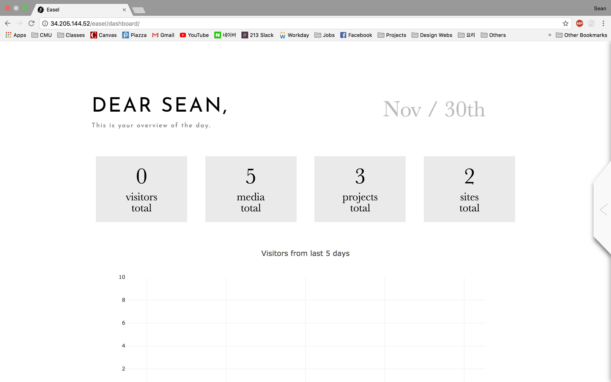
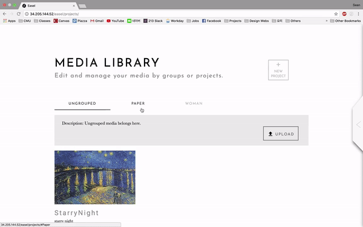

# Easel

  

## Contributors (Team 277)
- Sean D Kim
- Stella Kim
- Tiffany Lee

## What is Easel?
- Easel is a website where artist could easily make a website for themselves and publish it for general audience. To use the website, go to [this link](http://34.205.144.52/). This was created as a final project for Web Application class at Carnegie Mellon University.

## Features
1. Dashboard
  - You can see a general overview of your projects/sites.

  

2. Media Library
  - You can upload media, and group them into different projects.

  

3. Site Editor
  - You can make multiple sites, each could contain multiple pages.
  - You can publish for everyone to see and view the site immediately.

  

## Technical Specifications
### Libraries used
#### Backend
- [Django](https://www.djangoproject.com/)
- [AWS](https://aws.amazon.com/) for deployment

#### Frontend
- [SASS](sass-lang.com/)
- [Gulp](https://gulpjs.com/)
- [Materialize](http://materializecss.com/)
- [Medium-Editor](https://github.com/yabwe/medium-editor)

### Challenges
1. Customization vs Usability
  - Significant amount of time was dedicated to discuss our design decisions. Given that our target audience is people who do not professionally program or make website, we wanted our website to be user-friendly; at the same time, we wanted to have enough customization so that we can reach various audiences.
2. Loading content-heavy site
  - Our site editor became very content-heavy because it needed to load multiple html files (pages created by the user). We solved this issue by loading initial pages through Django page rendering with context, then loading any subsequent pages (such as opening a new page to edit).
3. Draggable vs Sortable vs Editable
  - This was perhaps the biggest challenge we had. On the editor (where you can edit the content of your website), we had to support three features. User can drag the default components from side menu and drop into the editor, user can sort components in different order, and user can edit the individual components. For each functionality, we set a specific event listeners and made sure there is no conflict in each.
4. Handling asynchronous loading
  - To make our site user friendly, we made almost all form submission happen through modals (popup window) rather than render new page. This meant that we could not reply on default form submission to handle data and rendering.
  - Make sure page and data are consistent, even if the asynchronous call is not successful.
