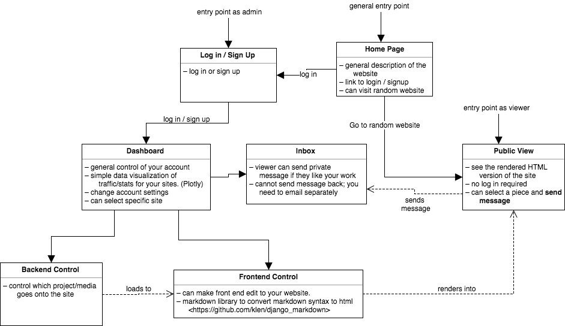

# Functionality

This document describes the functionality of each page. The list of specific technologies used can be found at `backlog.md`. The list of libraries used can be found at the end of `proposal.md`. 

## Diagram

## Extensive List

This is a text version of the diagram above. 

#### HOME PAGE (GENERAL ENTRY POINT)
- Viewers (either non-logged in or non-registered users) can see the description of the site
- Viewers may click on the link to log in or sign up for the site
- Viewers may visit the random portfolio sites

#### LOG IN / SIGN UP / LOG OUT
- Non-logged in, non-registered users may register for the site.
- New users must provide a username, password, first name, last name, and email.
- Registering for the site leaves the user logged in as newly-registered user
- Registered users may log in using their username and password
- Logged-in users are able to log out

#### USER DASHBOARD
- Logged-in users can edit their profile information and change their password in profile-editing page in user-dashboard
- Logged-in users are able to have simple data visualization of traffic / stats for their sites in user-dashboard
- Logged-in users can create a project and may edit the project information in user-dashboard
- Logged-in users can select a specific project to edit its content -> backend section
- Logged-in users can create a site and may edit the site information in user-dashboard
- Logged-in users can select a specific site to edit its UI/UX -> frontend section
- Logged-in users can view their inbox

#### BACKEND CONTROL
- Logged-in users can upload their artworks / media (i.e. image, video, audio) in the projects that they have created.
- Logged-in users may edit their artworks / media information
- Logged-in users can control which project / media goes onto the site which would load to the front-end control section

#### FRONTEND CONTROL
- Logged-in users can control which project / media goes onto the site
- Logged-in users can customize the components and layouts of portfolio
- Logged-in users can render their completed portfolio site

#### INBOX
- Logged-in users can view private messages that are sent from the viewers(either non-logged in or non-registered users) of their portfolio sites
- Logged-in users may not send message back to the sender; they need to email separately

#### PUBLIC VIEW
- Viewers(may be non-logged in or non-registered users) can see the rendered HTML version of the portfolio site
- Viewers can select a piece and send private message to the author
